# skills-v2 (CCG)

> 🏠 [返回根目录](../CLAUDE.md)

**Last Updated**: 2026-01-05 17:45:00 CST

## Module Overview

**CCG (Claude + Codex + Gemini)** 多模型协作系统 - 智能路由前端(Gemini) + 后端(Codex) 的完整开发工作流解决方案。

---

## Architecture

```mermaid
graph TD
    CCG["CCG 系统"] --> CMD["commands/ccg/"]
    CCG --> CAW["codeagent-wrapper/"]
    CCG --> PROMPTS["prompts/"]
    CCG --> BIN["bin/"]
    CCG --> MEM["memorys/"]

    CMD --> CMD1["dev.md - 6阶段工作流"]
    CMD --> CMD2["code.md - 智能代码生成"]
    CMD --> CMD3["frontend.md - 前端→Gemini"]
    CMD --> CMD4["backend.md - 后端→Codex"]
    CMD --> CMD5["review.md - 双模型审查"]
    CMD --> CMD6["commit.md - Git智能提交"]
    CMD --> CMD7["...其他11个命令"]

    PROMPTS --> P1["codex/"]
    PROMPTS --> P2["gemini/"]

    P1 --> P1A["architect.md"]
    P1 --> P1B["analyzer.md"]
    P1 --> P1C["debugger.md"]
    P1 --> P1D["optimizer.md"]
    P1 --> P1E["reviewer.md"]
    P1 --> P1F["tester.md"]

    P2 --> P2A["frontend.md"]
    P2 --> P2B["analyzer.md"]
    P2 --> P2C["debugger.md"]
    P2 --> P2D["optimizer.md"]
    P2 --> P2E["reviewer.md"]
    P2 --> P2F["tester.md"]

    BIN --> BIN1["codeagent-wrapper-darwin-amd64"]
    BIN --> BIN2["codeagent-wrapper-darwin-arm64"]
    BIN --> BIN3["codeagent-wrapper-linux-amd64"]
    BIN --> BIN4["codeagent-wrapper-windows-amd64.exe"]

    style CMD fill:#90EE90
    style PROMPTS fill:#87CEEB
    style CAW fill:#FFD700
```



---

## Directory Structure

```
skills-v2/
├── bin/                           # 预编译二进制文件
│   ├── codeagent-wrapper-darwin-amd64
│   ├── codeagent-wrapper-darwin-arm64
│   ├── codeagent-wrapper-linux-amd64
│   └── codeagent-wrapper-windows-amd64.exe
├── codeagent-wrapper/             # Go 源码
│   ├── main.go                    # 入口
│   ├── backend.go                 # 后端抽象
│   ├── executor.go                # 任务执行器
│   ├── logger.go                  # 日志系统
│   └── config.go                  # 配置管理
├── commands/ccg/                  # /ccg:xxx 命令 (19个)
│   ├── agents/                    # 子智能体（4个）
│   │   ├── get-current-datetime.md   # 获取当前时间戳
│   │   ├── init-architect.md         # 初始化架构师
│   │   ├── planner.md                # 任务规划师（WBS 分解）
│   │   └── ui-ux-designer.md         # UI/UX 设计师
│   ├── dev.md                     # 完整开发工作流
│   ├── code.md                    # 智能代码生成
│   ├── debug.md                   # UltraThink 调试
│   ├── test.md                    # 多模型测试生成
│   ├── bugfix.md                  # 质量门控修复
│   ├── think.md                   # 深度分析
│   ├── optimize.md                # 性能优化
│   ├── frontend.md                # 前端任务
│   ├── backend.md                 # 后端任务
│   ├── review.md                  # 代码审查
│   ├── analyze.md                 # 技术分析
│   ├── enhance.md                 # Prompt 增强
│   ├── scan.md                    # 智能仓库扫描（新增）
│   ├── feat.md                    # 智能功能开发（新增）
│   ├── commit.md                  # Git 智能提交
│   ├── rollback.md                # 交互式回滚
│   ├── clean-branches.md          # 清理分支
│   ├── worktree.md                # Worktree 管理
│   └── init.md                    # 项目初始化
├── prompts/                       # 专家系统提示词
│   ├── codex/                     # Codex 角色 (6个)
│   └── gemini/                    # Gemini 角色 (6个)
├── memorys/
│   └── CLAUDE.md                  # 核心工作流指令
├── config.json                    # 安装配置
└── install.py                     # 安装脚本
```

---

## Command Reference

### 开发工作流

| 命令 | 用途 | 模型路由 |
|------|------|----------|
| `/ccg:dev` | 完整6阶段开发工作流（含Prompt增强） | ace-tool + Codex + Gemini |
| `/ccg:code` | 多模型代码生成（智能路由） | 前端→Gemini / 后端→Codex |
| `/ccg:debug` | UltraThink 多模型调试 | Codex + Gemini 并行诊断 |
| `/ccg:test` | 多模型测试生成 | Codex 后端 + Gemini 前端 |
| `/ccg:bugfix` | 质量门控修复（90%+ 通过） | 双模型交叉验证 |
| `/ccg:think` | 深度分析 | 双模型并行分析 |
| `/ccg:optimize` | 性能优化 | Codex 后端 + Gemini 前端 |
| `/ccg:frontend` | 前端/UI/样式任务 | Gemini |
| `/ccg:backend` | 后端/逻辑/算法任务 | Codex |
| `/ccg:review` | 代码审查（无参数自动审查 git diff） | Codex + Gemini |
| `/ccg:analyze` | 技术分析 | Codex + Gemini |
| `/ccg:enhance` | Prompt 增强 | ace-tool MCP |

### Git 工具

| 命令 | 用途 |
|------|------|
| `/ccg:commit` | 智能 commit：分析改动、生成 conventional commit 信息 |
| `/ccg:rollback` | 交互式回滚：列分支、列版本、二次确认 |
| `/ccg:clean-branches` | 清理分支：安全查找并清理已合并分支 |
| `/ccg:worktree` | Worktree 管理：在 `../.ccg/项目名/` 下创建 |

### 项目初始化与规划

| 命令 | 用途 |
|------|------|
| `/ccg:init` | 初始化项目 AI 上下文，生成 CLAUDE.md 索引 |
| `/ccg:scan` | **智能仓库扫描**：生成项目上下文报告（技术栈、API、数据模型、组件结构）|
| `/ccg:feat` | **智能功能开发**：自动规划（planner + ui-ux-designer）→ 实施（多模型路由）→ 审查 |

---

## Expert System Prompts

调用外部模型时动态注入角色设定：

| 命令 | Codex 角色 | Gemini 角色 |
|------|-----------|-------------|
| `/ccg:code`, `/ccg:backend` | `prompts/codex/architect.md` | - |
| `/ccg:frontend` | - | `prompts/gemini/frontend.md` |
| `/ccg:analyze`, `/ccg:think`, `/ccg:dev` | `prompts/codex/analyzer.md` | `prompts/gemini/analyzer.md` |
| `/ccg:debug` | `prompts/codex/debugger.md` | `prompts/gemini/debugger.md` |
| `/ccg:test` | `prompts/codex/tester.md` | `prompts/gemini/tester.md` |
| `/ccg:review`, `/ccg:bugfix` | `prompts/codex/reviewer.md` | `prompts/gemini/reviewer.md` |
| `/ccg:optimize` | `prompts/codex/optimizer.md` | `prompts/gemini/optimizer.md` |

---

## Key Interfaces

### codeagent-wrapper 调用语法

```bash
# HEREDOC 语法（推荐）
codeagent-wrapper --backend <codex|gemini|claude> - [working_dir] <<'EOF'
<task content>
EOF

# 简单任务
codeagent-wrapper --backend codex "simple task" [working_dir]

# 恢复会话
codeagent-wrapper --backend codex resume <session_id> - <<'EOF'
<follow-up task>
EOF
```

### 输出格式

```
Agent response text here...

---
SESSION_ID: 019a7247-ac9d-71f3-89e2-a823dbd8fd14
```

---

## Slash Command 格式要求

⚠️ **重要**：子目录中的 slash commands 必须包含 YAML frontmatter，否则 Claude Code CLI 无法正确识别。

### 必需格式

每个 `.md` 命令文件必须以 YAML frontmatter 开头：

```markdown
---
description: 命令的简短描述
---

## Usage
...
```

### 完整示例

```markdown
---
description: 多模型技术分析（根据配置并行），交叉验证后综合见解
---

## Usage
`/analyze <QUESTION_OR_TASK>`
...
```

### 扩展格式（权限控制）

```markdown
---
description: 命令描述
allowed-tools: Read(**), Exec(git status, git diff), Write()
---
```

📖 **详细说明**：查看 [SLASH_COMMAND_FORMAT.md](./SLASH_COMMAND_FORMAT.md) 了解完整的格式要求、最佳实践和常见问题。

---

## Installation

```bash
cd skills-v2
python3 install.py
```

安装脚本会自动：
1. ✅ 安装核心工作流指令
2. ✅ 安装 17 个斜杠命令
3. ✅ 编译/使用预编译 codeagent-wrapper
4. ✅ 配置 ace-tool MCP（轻量级代码检索 + Prompt 增强）

---

## NPM 发布流程

### 前置要求
- npm 账户：`fengli_1227`
- npm token：Automation token (已配置在 `~/.npmrc`，绕过 2FA)

### 发布步骤

1. **更新版本号**
   ```bash
   # 编辑 package.json
   # "version": "1.0.x" → "1.0.y"
   ```

2. **配置 npm token**（一次性配置，已完成）
   ```bash
   # Token 已配置在 ~/.npmrc
   # 格式: //registry.npmjs.org/:_authToken=npm_YOUR_TOKEN
   ```

3. **构建并发布**
   ```bash
   pnpm build
   npm publish
   ```

4. **提交到 Git**
   ```bash
   git add -A
   git commit -m "chore: bump version to x.y.z"
   git push origin main
   ```

### 验证发布
```bash
npm view ccg-workflow version
npm view ccg-workflow time
```

### 注意事项
- ✅ 确保 token 写入 `~/.npmrc` 才能绕过 2FA
- ✅ `prepublishOnly` 钩子会自动运行 `pnpm build`
- ✅ 发布前确保所有测试通过
- ✅ 遵循语义化版本规范（SemVer）

---

## Dependencies

- Python 3.8+
- Claude Code CLI
- Codex CLI / Gemini CLI
- ace-tool MCP（安装脚本自动配置）
